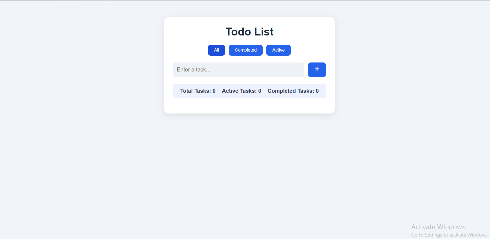

# React Todo App

A modern and responsive Todo List application built with React.

## Features

* Add new tasks
* Delete tasks
* Mark tasks as completed
* Undo completed tasks
* Filter tasks:

  * All
  * Active
  * Completed
* Task statistics:

  * Total Tasks
  * Completed Tasks
  * Remaining Tasks
* Save tasks using LocalStorage
* Responsive design

## Technologies

* React
* JavaScript (ES6+)
* CSS3
* Vite
* React Icons
* LocalStorage

## Project Structure

```text
src/
├── components/
│   ├── TodoForm.jsx
│   ├── TodoItem.jsx
│   ├── TodoFilter.jsx
│   ├── TodoStats.jsx
│   └── Todolists.jsx
│
├── App.jsx
└── main.jsx
```

## Screenshot



## Installation

Clone the repository:

```bash
git clone https://github.com/fshoja/react-todo-app.git
```

Go to the project folder:

```bash
cd react-todo-app
```

Install dependencies:

```bash
npm install
```

Run the development server:

```bash
npm run dev
```

Build for production:

```bash
npm run build
```

## Future Improvements

* Edit task titles
* Add dark mode
* Add animations
* Add user authentication

## Author

Farzaneh Shoja

GitHub:

https://github.com/fshoja
